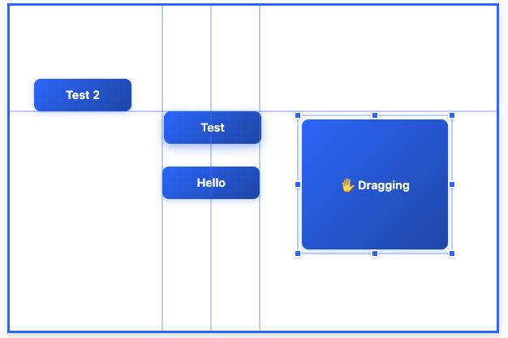

# ngx-snapmove

A modern Angular library for interactive element positioning with pixel-perfect grid snapping, automatic alignment detection, and visual guide lines.

🔗 **[Live Demo](https://jur97.github.io/ngx-snapmove/)** | [Package README](projects/ngx-snapmove/README.md)



## 📖 Library Documentation

**👉 For library usage and features, see [projects/ngx-snapmove/README.md](projects/ngx-snapmove/README.md)**

## 🛠️ Development

This is a monorepo workspace for developing and testing the ngx-snapmove library.

### Setup

```bash
npm install
```

### Development Server

```bash
npm start
```

Runs the test-space demo app at `http://localhost:4200/`

## 📁 Project Structure

- `projects/ngx-snapmove/` — The library source code (published to npm)
- `projects/test-space/` — Demo application for testing and development

## Additional Resources

For more information on using the Angular CLI, including detailed command references, visit the [Angular CLI Overview and Command Reference](https://angular.dev/tools/cli) page.
